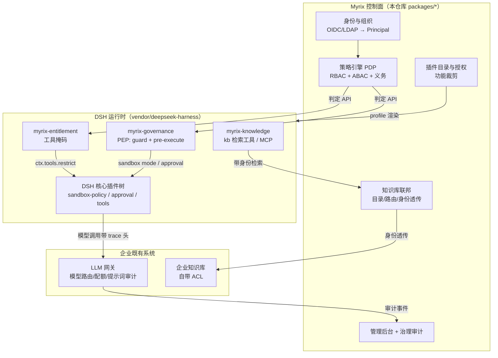

# Myrix

> 基于 [DeepSeek Harness](https://github.com/deepseek-ai/deepseek-harness) 的企业私有化 Agent 平台

**一句话定位**：DSH 提供 Agent 运行时，Myrix 提供企业治理面——账号体系、RBAC/ABAC 细粒度授权、
插件与功能裁剪、知识库联邦、管理后台。所有治理能力都通过 DSH 的 Cordis 插件机制挂载，**不 fork、不改 DSH 核心**。

| 项 | 值 |
| --- | --- |
| 上游 fork | `git@github.com:hewenyu/deepseek-harness.git` |
| 子模块路径 | `vendor/deepseek-harness` |
| 锁定提交 | `639ed015397290b3745d163aafe02ffee4aa3f84`（DSH `0.2.0-rc.2` 之后一次合并） |
| 本仓库角色 | 治理控制面（PDP）+ DSH 侧执行插件（PEP）+ 管理后台 + 部署与运维脚本 |
| 许可证 | **Apache-2.0**（可商用，见 [LICENSE](LICENSE) 与 [NOTICE](NOTICE)；上游 DSH 为 MIT） |

---

## 一、三个问题的答案（TL;DR）

### 1. 权限管控怎么二开？→ 分层治理，与 DSH 权限解耦

- **DSH 的沙箱权限（ReadOnly / WorkspaceWrite / DangerFullAccess）与审批机制是"执行机制"，不是"授权来源"**。
  企业授权在 Myrix 控制面判定，DSH 只负责执行。
- 控制面做 **PDP**：RBAC 决定"能不能用某类能力"（角色权限点），ABAC 决定"在什么条件下、以什么方式用"（条件 + 义务）。
- DSH 侧做 **PEP**：`tools/pre-execute`（allow/deny/ask）+ `ctx.tools.guard`（单调兜底，只能收紧）。
- 策略结论翻译成 DSH 原生旋钮：`sandbox-policy.mode` / `permissionPresets` / `approval.policy` / 工具掩码 / 配额与模型范围。
- 详见 [ADR-0001 分层治理](docs/adr/0001-layered-governance.md)。

### 2. 知识库怎么集成？→ 联邦 + 身份透传，不复制 ACL、不用服务账号

- 平台**不做 RAG 引擎**，只做：目录聚合、跨库路由、身份透传、结果合成、审计。
- 每条检索都带主体身份打到企业知识库，**由知识库自己的权限系统裁决**；平台只能收窄范围，不能放大。
- 两条接入路线：A) 平台工具（逐调用带身份，推荐给"知识库自带 ACL"的场景）；B) 标准 MCP（`streamable-http`，适合知识库侧已有 MCP Server，但 DSH 0.2.0-rc.2 的 MCP 凭据是静态的，需注意）。
- 详见 [ADR-0003 知识库联邦](docs/adr/0003-knowledge-federation.md)。

### 3. 功能怎么裁剪？→ 插件目录 + 按人授权 + profile 渲染 + 运行时掩码

- **插件目录（catalog）** 是"可选功能"的唯一事实来源，包含 DSH bundle/plugin、tool、skill、MCP server。
- 授权计算：租户基线 → 授权叠加 → 策略 deny 覆盖 → 依赖闭合 → 冲突收敛，**每一步都产出"为什么开/关"的原因**。
- 两段式落地：**profile 渲染**（关掉 cordis 行 / 只加载需要的 bundle，冷路径）+ **运行时工具掩码**（授权变更即时生效，热路径）。
- 管理后台把这些变成可见、可操作、可审计的界面。
- 详见 [ADR-0005 管理后台](docs/adr/0005-admin-console.md)。

### 模型与审计 → 放在 LLM 网关层

Myrix 不在 DSH 内做模型治理，只定义契约：请求头透传 `x-myrix-tenant / principal / session / agent / trace`，
策略下发 `rateLimit`、`modelScope` 义务；提示词与响应级审计、成本与配额由网关产生，通过 `traceId` 与治理事件关联。
契约可直接查看：`GET /api/v1/gateway/contract`。详见 [ADR-0004 LLM 网关边界](docs/adr/0004-llm-gateway-boundary.md)。

---

## 二、架构



分层职责边界：

| 层 | 负责 | 不负责 |
| --- | --- | --- |
| 控制面（PDP） | 身份归一、策略判定、功能授权、知识库目录、治理审计、管理后台 | 工具执行、进程隔离、模型调用 |
| DSH 侧插件（PEP） | 调用判定、执行拦截、掩码与沙箱/审批落配置 | 保存策略、管理用户、保存企业 ACL |
| DSH 核心 | Agent 循环、工具管线、沙箱与审批的执行 | 企业 RBAC/多租户/RAG（上游确实没有） |
| LLM 网关 | 模型路由、配额、成本、提示词/响应审计 | 工具级授权 |
| 企业知识库 | **最终 ACL 裁决**、向量/关键词检索 | 平台账号体系 |

---

## 三、目录结构

```
myrix/
├── vendor/deepseek-harness/        # submodule：DSH 上游 fork（锁定提交）
├── packages/
│   ├── contracts/                  # 共享契约：Principal / Policy / Entitlement / Knowledge / Audit
│   ├── governance/                 # PDP：条件求值、deny-overrides 判定、义务合并、角色继承
│   ├── registry/                   # 插件目录、依赖闭合、按人授权、profile 渲染
│   ├── knowledge/                  # 知识库联邦（连接器契约 + 内存参考实现）
│   ├── dsh-shim/                   # DSH Cordis 接口最小结构子集（待替换为官方类型）
│   └── control-plane/              # HTTP API + 演示种子 + 审计
├── plugins/                        # 挂到 DSH 上的 PEP 插件（bundle 形态，含 cordis.patch.yml）
│   ├── dsh-plugin-governance/
│   ├── dsh-plugin-entitlement/
│   └── dsh-plugin-knowledge/
├── apps/console/                   # 管理后台（无构建依赖的原生前端，由控制面同源托管）
├── deploy/                         # docker-compose / Dockerfile / Postgres 迁移 / 企业 profile 示例
├── docs/                           # 架构、ADR、DSH 对接清单、路线图、原始调研证据
└── scripts/                        # bootstrap / profile 渲染 / 判定演示
```

---

## 四、快速开始

```bash
# 1) 初始化（子模块 + 依赖 + 类型检查 + 测试）
pnpm bootstrap

# 2) 启动控制面与管理后台（默认 http://127.0.0.1:8787/ ）
pnpm dev
#    数据面/后台令牌：MYRIX_ADMIN_TOKEN，默认开发值 dev-admin-token（生产必须覆盖）

# 3) 判定演示：看到两级判定与义务
pnpm demo:decide

# 4) 按主体渲染 DSH profile
pnpm render:profile u_1001 --out "${DSH_HOME:-$HOME/.dsh}/profiles/enterprise"

# 5) 单元测试
pnpm test
```

管理后台页面：概览 / 身份与角色 / 权限模拟 / 功能裁剪 / 知识库 / 审计 / 模型与审计边界。

---

## 五、当前完成度（诚实的 M0 状态）

已实现并有测试覆盖：

- 策略引擎：属性路径、条件算子（含数组/时间/数值）、deny-overrides、义务合并（沙箱取最严、审批取并、范围取交）
- RBAC：角色继承展开、租户隔离、缺失角色显式暴露
- 功能裁剪：插件目录、依赖闭合（缺能力则裁掉并给出原因）、按主体授权计算、profile 产物渲染（`disabled` 行 + `insert` 行 + `dsh.profile.bundles`）
- 知识库联邦：连接器契约、可见性收窄、跨库合并排序、故障隔离
- 控制面 API：判定、授权、目录、知识库、审计、profile 预览、网关契约；Bearer 鉴权、fail-closed
- 管理后台：七个页面，全部走控制面 API
- 39 个单元测试 + `tsc` 严格类型检查（`pnpm typecheck` / `pnpm test`）

尚未完成（下一阶段）：

- DSH 侧插件的真实接线验证：在 `vendor/deepseek-harness` 上跑通 `tools/pre-execute`、`ctx.tools.guard`、`ctx.tools.restrict`、`permissionPresets.set` 的**实际签名**（当前用 `packages/dsh-shim` 占位类型，见 [对接清单](docs/integration/dsh-seams.md)）
- 身份注入：DSH 现有连接层是"单 operator"模型，多用户共进程需要自建 Connection provider 或在 BFF 层派生 peer（ADR-0002 有取舍）
- Postgres 持久化（迁移已写好，控制面目前是内存实现）
- 控制面自身的 OIDC 登录（当前后台用静态令牌）
- RAG 检索质量工程（分块、重排、引用）属于知识库侧，平台只做联邦

---

## 六、设计原则

1. **治理与执行分离**：策略永远不在数据面判定，数据面只执行结论（PDP/PEP 分离）。
2. **只收窄，不放大**：所有合并/掩码/范围都取交集或最严格档；fail-closed 是默认值。
3. **可解释**：每次判定都带 `matchedRules`，每次裁剪都带原因，每次变更都进审计。
4. **不改上游**：全部通过 Cordis 插件 + profile/patch 扩展；上游升级只需推进 submodule 提交。
5. **边界写进契约**：模型/审计在网关、ACL 在知识库，平台不越界复制能力。

---

## 七、与 DSH 的版本策略

- 子模块锁定到某个提交，CI 与本地都按该提交构建；升级 = 推进子模块 + 跑一次回归（见 `pnpm submodule:sync`）。
- 生产消费有两种形态：**源码形态**（从 `vendor/deepseek-harness` 本地构建，便于打补丁）与 **发布包形态**（消费 `@deepseek-ai/dsh-*` npm 包，便于灰度升级）。ADR-0001 记录了取舍，M1 需要在 CI 中固化其中一种。
- 深度对接依据全部记录在 [docs/integration/dsh-seams.md](docs/integration/dsh-seams.md)，原始证据（带 `路径:行号`）在 [docs/research/dsh-seams-raw.md](docs/research/dsh-seams-raw.md)。

---

## 八、待一起确认的问题

1. **管理后台的部署形态**：独立服务（当前实现）还是做成 DSH 内的第二个 WebServer（`cordis:group` + `isolate.webServer`）？
2. **多用户形态**：一人一 Harness home（隔离强、成本高），还是共进程 + 自建 Connection provider 让 `PeerScope` 携带企业身份（成本低、改造深）？
3. **上游依赖形态**：源码 submodule 构建 vs npm 发布包；是否允许给上游提补丁/维护内部 patch 队列？
4. **身份来源**：OIDC（飞书/Keycloak/Authing）还是 LDAP/AD？组信息是否作为角色绑定的主来源？
5. **知识库形态**：企业现有的是哪一类（向量库 / ES / 语雀·Confluence / 自研 API）？是否已有 MCP Server？
6. **LLM 网关**：已有网关是什么（自研 / LiteLLM / new-api / OneAPI）？`x-myrix-*` 头能否透传与落库？
7. **审批落地**：风险操作的审批走 DSH 原生 ask 弹窗，还是对接企业工单/审批流（钉钉、飞书审批）？
8. **合规**：数据驻留、审计留存期限、是否要求"提示词不入平台库"（当前设计默认不入）。

---

## 九、许可与合规

- **本仓库：Apache License 2.0**，见 [LICENSE](LICENSE)。可商用、可修改、可闭源分发衍生作品；
  分发时需保留 `LICENSE` 与 [NOTICE](NOTICE)，并对修改过的文件作出"已修改"声明。
- **上游 DSH：MIT**，见 [vendor/deepseek-harness/LICENSE](vendor/deepseek-harness/LICENSE)（`Copyright (c) 2026 DeepSeek`）。
  以 submodule 形式引入且未修改源码；MIT 与 Apache-2.0 兼容，再分发时请一并保留其许可与版权声明。
- **商标**：Apache-2.0 不授予商标权。`DeepSeek`、`DeepSeek Harness` 等名称与标识的权利归其所有者；
  对外宣传不要暗示官方背书。
- **企业分发建议**：对外交付产品时，把 `LICENSE`、`NOTICE` 与第三方依赖许可清单（`pnpm-lock.yaml` 对应的
  LICENSE 集合）一并打包；若后续加入商业插件，注意与 Apache-2.0 的兼容性（Apache-2.0 允许闭源衍生作品，
  但需保留声明）。
