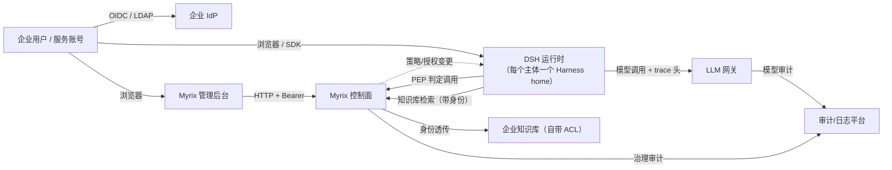
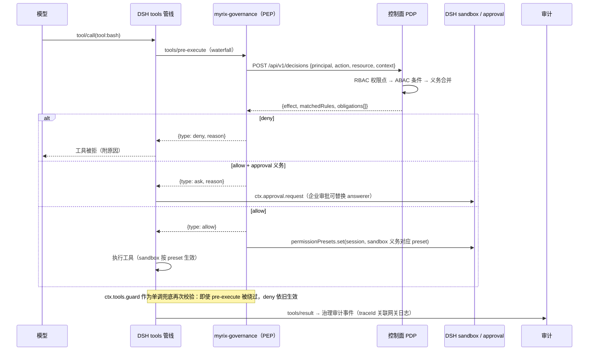
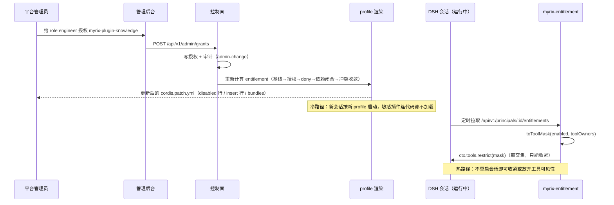
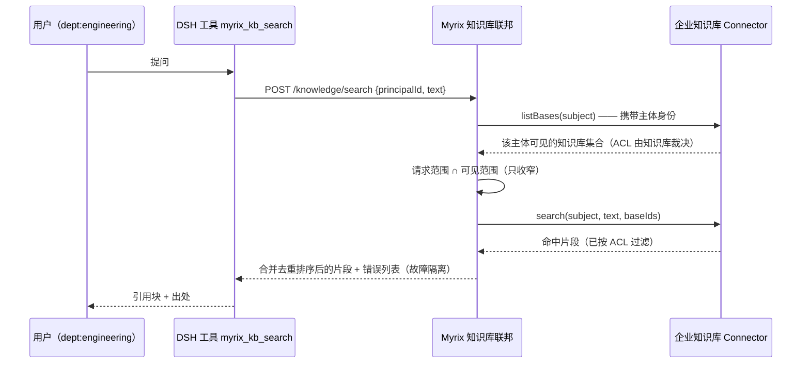

# 总体架构

本文回答四个问题：**系统由哪些部分组成、边界在哪里、一次请求怎么流动、出故障时怎么办。**

## 1. 系统上下文

关键点：**控制面是治理的唯一权威，DSH 是执行方，LLM 网关负责模型侧，知识库负责数据侧 ACL。**

## 2. 分层与职责边界

| 层 | 组件 | 必须做 | 禁止做 |
| --- | --- | --- | --- |
| 身份层 | IdP 适配 + Principal 归一 | 组/部门/属性同步、账号生命周期 | 在 DSH 内维护账号 |
| 决策层（PDP） | `@myrix/governance` | 纯函数判定、义务合并、可解释 | 任何 I/O、调用工具 |
| 授权层 | `@myrix/registry` | 目录、依赖闭合、按主体授权、profile 渲染 | 运行时代码加载决策（那是 DSH 的） |
| 执行层（PEP） | `plugins/*` | 取判定结果、翻译为 DSH 配置、fail-closed | 保存策略、绕过判定直接执行 |
| 运行时 | DSH（submodule） | Agent 循环、工具管线、沙箱与审批执行 | —— |
| 模型层 | 企业 LLM 网关 | 路由、配额、成本、提示词审计 | 工具级授权 |
| 数据层 | 企业知识库 | **最终 ACL 裁决**、检索质量 | 平台账号体系 |

## 3. 关键流程

### 3.1 一次工具调用的鉴权（PEP 视角）

两级判定的意义：

- **RBAC 决定"能不能用某类能力"**：`tool:bash` 这种权限点由角色给出，没有就是硬拒绝，不进 ABAC（性能好、语义清楚）。
- **ABAC 决定"在什么条件、以什么方式用"**：同一权限点，在风险分、时间、数据分级等条件下产生不同义务（沙箱档位、是否审批、配额、模型范围、知识库范围）。

### 3.2 功能裁剪：从后台一次授权到运行时生效

**为什么两段式**：profile 是冷路径（进程/代码级），掩码是热路径（会话级）。安全要求高的功能走冷路径
（不加载 = 不可利用），日常细粒度调整走热路径（秒级生效）。

### 3.3 知识库检索的身份透传

**绝不用服务账号代查**：一旦平台用服务账号检索，就会在平台侧放大权限，且需要复制一份 ACL（必然过期）。
代价是要求企业知识库支持"以用户身份检索"（API 网关透传或令牌兑换）——这是接入前必须确认的前提。

## 4. 数据模型概览

治理数据全部带 `tenant_id`，见 [deploy/postgres/migrations/0001_init.sql](../deploy/postgres/migrations/0001_init.sql)。

| 表 | 作用 | 关键设计 |
| --- | --- | --- |
| `principals` | 主体（用户/服务/agent） | 存 `(idp, external_id)` 映射，属性用 `jsonb`，组用 `text[]` 便于 GIN 索引 |
| `roles` / `role_bindings` | RBAC | 绑定支持 `scope_type/scope_id`，为将来"按资源域授权"留位置 |
| `policy_revisions` / `policies` | ABAC | **修订不可变**：审计能回答"当时为什么放行" |
| `plugins` / `plugin_grants` / `tenant_plugin_baseline` | 功能裁剪 | 授权对象是 `u_xxx / role:xxx / group:xxx / tenant:xxx` |
| `knowledge_connectors` / `knowledge_bases` | 知识库目录 | 只存元信息与 `secret_ref`，不存正文与明文凭据 |
| `audit_events` | 治理审计 | 与网关通过 `trace_id` 关联 |
| `llm_gateway_calls` | 模型用量 | 由网关写入，平台不入提示词正文 |

## 5. 部署形态

| 形态 | 隔离性 | 成本 | 适用 |
| --- | --- | --- | --- |
| A. 一人一 Harness home + profile | 强（进程/文件/会话级） | 高（每人一个进程） | 高合规、涉密岗位 |
| B. 共进程 + 自建 Connection provider 携带企业身份 | 中（依赖 BFF 与 peer 派生） | 低 | 大规模普通岗位 |
| C. 混合：普通岗位 B，敏感岗位 A | 可调 | 可控 | 推荐起步 |

控制面始终是**单一多租户服务**；DSH 运行时按形态部署。当前骨架实现的是 A 的 profile 渲染与 B 的
PEP 前提（`principalId` 由 profile/连接层注入）。

## 6. 失败模式与降级策略

| 故障 | 行为 | 理由 |
| --- | --- | --- |
| 控制面不可达（判定失败） | **拒绝**（`failClosed: true`，默认） | 治理面故障不应变成"无限制通行" |
| 控制面不可达（授权拉取失败） | 保持上次掩码；首次失败不额外放宽 | 避免抖动导致权限漂移 |
| 策略 revision 更新滞后（缓存 15s） | 最多滞后一个 TTL；可在配置里调小/置 0 | 兼顾判定延迟与实时性 |
| 知识库 Connector 超时/报错 | 仅该 Connector 结果缺失，返回 `errors`，其余照常 | 故障隔离优于整体失败 |
| LLM 网关限流/降级 | 由网关处理；平台只下发 `rateLimit`/`modelScope` 义务 | 边界清晰 |
| 审计写入失败 | 当前实现为内存环形缓冲；生产要求先落本地 WAL 再转发 | 审计不可丢，M1 待补 |

## 7. 信任假设与安全边界

- 控制面的判定 API 只暴露给数据面（内网 + 数据面令牌），**数据面令牌不能管理策略**。
- 管理后台需要独立认证（M1 接 OIDC），当前骨架用静态令牌并在启动时告警。
- DSH 侧插件运行在 Harness 进程内，**不受 workspace 沙箱限制**——因此插件来源必须白名单化（只允许
  `@myrix/*` 与受审计的第三方包），这也正是"功能裁剪走 profile 冷路径"的原因之一。
- 平台不保存提示词正文与知识库正文；只保存判定元数据、片段引用与用量。

## 8. 与 DSH 的接缝

对接清单（用哪些扩展点、依据行号、风险与待验证项）见 [integration/dsh-seams.md](integration/dsh-seams.md)。
