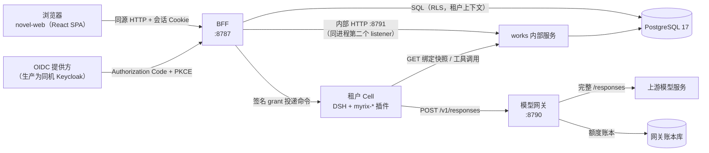
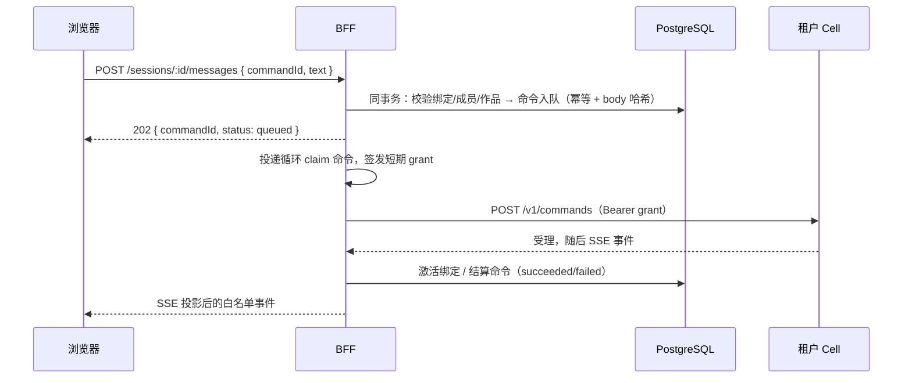
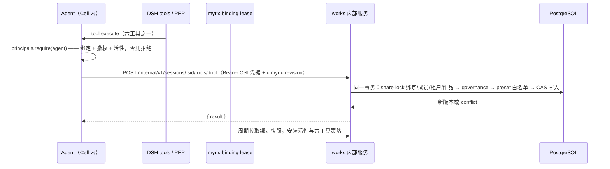

# 总体架构

本文只负责回答：**当前主线由哪些部分组成、边界在哪里、一次请求怎么流动、失败时怎么办、哪些只是历史或愿景。**

> **文档状态**：2026-10 复盘后重写。旧版把 M0 内存治理原型当作"当前骨架"，已不符合主线；
> 该原型现在统一标注为【历史】。架构结论来自源码核对，本轮测试与演示登录的独立证据见
> [项目复盘（2026-10）](<reviews/project-review-2026-10.md>)及[验收指南](<testing/acceptance.md>)。

## 0. 状态标签

标签用词与 [文档维护、归档与脱密](<documentation-policy.md>) 对齐：

| 标签 | 含义 | 判据 |
| --- | --- | --- |
| 【现状】/当前实现 | 当前生产/开发主线的一部分 | 源码中存在完整实现，且在 `pnpm dev` / VPS 装配中被实际引用 |
| 【待验收】 | 实现已就位，但缺少生产环境实跑记录 | 见 [路线图 M1](<roadmap.md>) |
| 【愿景】 | 只有契约、规划或部分实现，未接入主线 | 没有运行入口引用，或缺少权威调用方 |
| 【历史】/历史记录 | 早期原型，保留供迁移参考 | 只由 `pnpm dev:legacy` 启动，生产 bundle 不加载 |

**一句话现状**：`novel-web → BFF/works → 每租户一个 Cell（DSH + myrix-*）→ Responses 模型网关 / PostgreSQL`。

## 1. 现状：系统上下文

要点：

- BFF 与 works 是**同一进程里的两个 Fastify 实例**（`:8787` 浏览器边界、`:8791` 仅内部），不是两个独立服务；
  见 [`createProductionBff`](<../apps/bff/src/production.ts#L57-L75>)、[`createWorksServer`](<../apps/bff/src/works-server.ts#L163-L186>)。
- **一个租户一个 Cell**：Cell 是独立的 DSH 进程（生产为容器），加载白名单插件；
  见 [`createStaticCellDirectory`](<../apps/bff/src/runtime-cells.ts#L105-L150>)。
- **BFF/works 与 Cell 之间只走显式凭据 + 短期签名 grant**，不共享数据库连接；
  见 [`runtime-driver-client`](<../apps/bff/src/runtime-driver-client.ts#L9-L13>)。
- **模型链路只讲 OpenAI Responses**：入站只有 `POST /v1/responses`，旧 `chat/completions` 路径明确 404；
  见 [`server.ts`](<../apps/model-gateway/src/server.ts#L71-L94>)、[ADR 0023](<adr/0023-responses-gateway.md>)。
- 模型网关是**唯一持有上游模型密钥的组件**；Cell 与浏览器都不持有。

## 2. 组件职责与边界

### 2.1 主线组件

| 组件 | 形态 | 负责 | 不负责 |
| --- | --- | --- | --- |
| [novel-web](<../apps/novel-web/src/api/endpoints.ts>) | 浏览器 SPA | 交互、编辑器、会话与 SSE 消费、客户端状态 | 服务端实现、直连数据库或 DSH |
| [BFF](<../apps/bff/src/server.ts>) | Fastify `:8787` | OIDC 登录、Cookie/CSRF/Origin 校验、浏览器 API、命令编排、SSE 投影 | 复制授权算法、把模型密钥或数据库凭据交给 Cell |
| [works 内部服务](<../apps/bff/src/works-server.ts>) | Fastify `:8791`，同进程 | Cell 凭据、工具调用授权链、绑定快照、六工具路由 | 公网暴露、接受浏览器请求 |
| [租户 Cell](<../bundles/myrix-base/cell.patch.yml>) | 独立 DSH 进程 | Agent 循环、工具执行、预设作用域、把模型调用交给网关 | 持有企业授权真相、数据库凭据、上游密钥、OIDC secret |
| [platform-store](<../packages/platform-store/src/index.ts>) | 库 | RLS 租户上下文、所有权、CAS、事务、持久化用例 | HTTP、Cordis 生命周期 |
| [governance](<../packages/governance/src/index.ts>) | 纯函数 | 平台授权判定、deny 覆盖、义务合并、可解释原因 | I/O、数据库、隐式时钟 |
| [模型网关](<../apps/model-gateway/src/server.ts>) | Fastify `:8790` | Responses 校验、归因、额度预占/结算、撤权中止、上游调用 | 工具级授权、协议隐式回退 |
| PostgreSQL | PG 17 | 业务数据、RLS、认证 schema、网关账本 | —— |

### 2.2 Cell 内的插件行（白名单）

Cell profile 是可选的第二层 patch，逐行显式列出真实包，没有 `dsh-base`、shell、fs、web、jobs、
settings 等通用能力；见 [cell.patch.yml](<../bundles/myrix-base/cell.patch.yml#L25-L52>)。插件清单：

| 行 | 作用 |
| --- | --- |
| `@deepseek-ai/dsh-host-webserver` | Cell 的 HTTP 载体（不是 `dsh-web-app`） |
| `@myrix/principals` | `ctx.principals`：Agent → 主体的可信绑定表 |
| `@myrix/policy-enforcer` | fail-closed 同步工具守卫（`allowedTools: []` 表示什么都不允许） |
| `@myrix/binding-lease` | 主体活性租约 + 六工具策略快照的唯一生产者 |
| `@myrix/runtime-driver` | `POST /v1/commands`、SSE、撤权、drain、`GET /v1/ready` |
| `@myrix/llm-gateway` | 模型路由：每次调用都经企业网关并携带会话归因 |
| `@myrix/novel` | 小说纵向能力：`ctx.novelStore` 与四个 preset（统一创作助手 + 三个历史受限 preset，工具在 preset 作用域内注册） |

## 3. 关键流程

### 3.1 浏览器读写（BFF）

1. 浏览器同源携带 `myrix_session` Cookie（HttpOnly / SameSite=Lax / 生产 Secure）；
   见 [`registerAuth`](<../apps/bff/src/auth.ts#L54-L99>)。
2. 变更类请求必须 `Origin` 精确匹配且带与服务端会话绑定的 `X-CSRF-Token`；两者任一失败即 403。
3. 身份每次从数据库重新读取（成员/租户停用立即 401），不使用登录时快照。
4. BFF 用 `PlatformStore` 在 `tenant_id` RLS 上下文里执行仓储操作；浏览器无法提交 actor / tenant / owner。

### 3.2 会话命令投递（BFF → Cell）

- 绑定与 `create` 命令在**同一事务**里写入；见 [`SessionsRepository.create`](<../packages/platform-store/src/repositories/bindings.ts#L56-L130>)。
- 命令落到 `commands` 表，带 `op`、`body_hash`、状态机与租约；见 [`commands.ts`](<../packages/platform-store/src/repositories/commands.ts#L90-L308>)。
- 投递前用 `/v1/ready` 的 bootId 与命令回执做恢复判定；见 [ADR 0028](<adr/0028-runtime-session-recovery.md>)。
- SSE 只做白名单投影，未知名不投影；订阅期间持续复核授权；见 [`runtime-router.ts`](<../apps/bff/src/runtime-router.ts#L1425-L1486>)。
- 会话归档/恢复是 `PATCH /sessions/:id { archived }` 的**元数据写**（[`setArchived`](<../packages/platform-store/src/repositories/bindings.ts#L365-L470>)）：不入 `commands`、不投递、不通知 Cell、不动 `status`/`rev`。归档期间只有新的 `send` 被拒（409 `session_archived`）；`cancel`、事件流与已入队命令照常，见 [ADR 0034](<adr/0034-novel-assistant-and-session-archive.md>)。

### 3.3 工具调用与作品写入（Cell → works → PostgreSQL）

工具命令**不接受任何身份参数**；`workId/owner/tenant` 由 works 服务按会话绑定查库取得；
见 [ADR 0017](<adr/0017-novel-tools-boundary.md>)、[`works-server.ts`](<../apps/bff/src/works-server.ts#L44-L81>)。
工具返回前经窄化投影，避免存储层字段触发 DSH 的严格输出校验；见 [ADR 0026](<adr/0026-novel-write-output.md>)。

### 3.4 模型调用（Cell → 网关 → 上游）

- Cell 适配器只认 `baseURL`，逐次追加 `/responses`；上游密钥不在 Cell。
- 网关只认三个判定头：`Authorization`（Cell 服务令牌）、`x-myrix-session`、`x-myrix-revision`，
  其余归因头一律忽略；见 [model-gateway.md](<implementation/model-gateway.md>)。
- 网关在 RLS 内读取绑定与成员、核对父子资源状态、预占额度，再调上游完整 `/responses`；
  见 [ADR 0023](<adr/0023-responses-gateway.md>)、[ADR 0020](<adr/0020-production-assembly.md>)。

### 3.5 主体活性与策略租约

- 主体活性不是永久授权：租约默认 10s、刷新 3s、上限 30s，任一失败立即清空，
  且**失败即拒绝**；见 [`myrix-binding-lease`](<../plugins/myrix-binding-lease/src/index.ts#L24-L35>)。
- 策略快照同样来自 works 服务，`requirePolicy: true` 时"没有有效快照 = 不允许任何工具"；
  见 [ADR 0019](<adr/0019-cell-binding-leases.md>)、[ADR 0025](<adr/0025-novel-deployment-policy.md>)。
- 每次真实工具/模型操作仍回到数据库核对当前绑定、成员、租户与版本，租约只缩小窗口。

## 4. 数据模型与不变量

业务表见 [`schema.ts`](<../packages/platform-store/src/schema.ts#L29-L248>) 与
[`packages/platform-store/src/migrations/`](<../packages/platform-store/src/migrations>)。

| 表组 | 作用 | 关键不变量 |
| --- | --- | --- |
| `tenants` / `members` | 租户与成员 | 角色仅 `admin / member / auditor`；不能停用/降级最后一名 admin |
| `works` | 作品 | 单一 owner；列表永远按 `owner_user_id` 过滤，admin 也不能读他人正文 |
| `chapters` / `chapter_versions` | 章节与版本 | 版本表只追加；写入走 CAS（`expectedVersion`） |
| `outline_documents` / `outline_versions` | 大纲与版本 | 同上，大纲对外是纯文本 wire |
| `bible_entries` / `bible_entry_versions` | 设定与版本 | 同上，条目必须属于同一作品 |
| `session_bindings` | 会话绑定 | `status + revoked_revision` 同时参与判定；撤权即 `rev+1`；`archived_at` 是正交的展示元数据（归档不撤权、不停止任务，只拒新的 `send`） |
| `commands` | 会话命令 | `(tenant_id, id)` 唯一；`body_hash` 校验；状态机 + 租约 + 退避 |
| `outbox_messages` | 跨进程通知 | 与业务同事务写入，至少一次投递 |
| `audit_events` | 治理与数据审计 | 追加写；带 effect / reason / matched_rules / trace_id |

隔离由数据库强制：业务表 `ENABLE + FORCE ROW LEVEL SECURITY`，运行角色
`NOSUPERUSER / NOBYPASSRLS / NOCREATEDB / NOCREATEROLE` 且非表 owner；
见 [`0000_roles.sql`](<../packages/platform-store/src/migrations/0000_roles.sql#L5-L15>)、
[`0001_tenancy.sql`](<../packages/platform-store/src/migrations/0001_tenancy.sql#L23-L26>)。

## 5. 身份、授权与默认拒绝

- **认证**：生产仅 OIDC Authorization Code + PKCE，校验 state / nonce / issuer / ID Token；
  身份来自预置的 `(issuer, subject) → (tenantId, userId)`，未知 subject 不自动注册；
  见 [ADR 0013](<adr/0013-bff-authentication.md>)。开发登录只在显式 loopback 模式启用，绝不作为生产回退。
- **授权**：`governance` 是纯函数 PDP；平台动作（`works:*`、`chapters:*`、`sessions:*`、`members:*`）
  以成员角色 + 资源所有者 + 当前状态 + 期望版本共同判定；deny 覆盖 allow。
- **内容归属**：单所有者模型。同租户非属主返回 403、跨租户返回 404，admin 没有正文旁路。
- **工具**：只有六个小说工具，且必须先通过 Cell 凭据、绑定/Cell 匹配、active 成员与租户、
  governance、preset 白名单、作品所有权，再进入 CAS；
  见 [`preset-tools`](<../plugins/myrix-novel/src/preset-tools.ts>) 与
  [`novel-protocol`](<../packages/novel-protocol/src/index.ts#L4-L10>)。
- **合并只会收窄**：沙箱取最严、范围取交集、掩码 deny 优先；未知工具名在装配期直接失败。

## 6. 部署形态

### 6.1 现状：单台 VPS

首版部署目标是**一台 VPS**：容器编排运行 BFF/works、模型网关、独立 Cell 与 PostgreSQL，
IDP 同机运行，宿主上既有的反向代理终结 TLS 并放通 OIDC 路径。数据库、网关与 Cell 都不发布公网端口；
运行服务使用独立低权登录，迁移是显式的独立作业。

细节与操作步骤见 [单机部署指南](<deployment/self-hosting.md>)，认证装配见
[认证装配](<deployment/authentication.md>)，备份/恢复见 [备份与恢复](<deployment/backup-restore.md>)。
**VPS 的“实现已就位”不等于“完整生产验收通过”**：演示专用账号真实 OIDC 登录已验证；owner 首次改密、公网模型调用与重启恢复未在本轮执行。其他自部署环境仍须逐项实测。

### 6.2 本地开发

`pnpm dev` 启动持久化 BFF/works、模型网关与两个隔离 Cell；`pnpm dev:legacy` 是历史演示，
两者不要同时运行。安装、初始化与验收分层见 [本地开发指南](<implementation/local-development.md>)。

### 6.3 【愿景/另有实现，未证明上线】Kubernetes

仓库里有一套**独立的** Kubernetes 实现：Helm chart、`TenantCell` CRD、Go `cell-manager` 控制器，
以及 Cell 侧的 drain/revoke 契约。它**不是当前上线形态，也没有真实集群验证**：

- chart 头部明确写明"没有任何 value 经过在线集群验证"；见 [values.yaml](<../deploy/helm/myrix/values.yaml#L14-L20>)。
- Cell 管理器自身的状态表把"真实集群验证"列为**未执行**；
  见 [cell-manager.md](<implementation/cell-manager.md>)。
- 已知启用阻断项：驱动器客户端对 drain/idle 的调用缺少凭据，而 driver 路由要求认证；
  当前 VPS 不依赖这条链路。见 [模块边界评审](<reviews/module-boundaries-2026-10.md>)。

因此本文把 K8s 视为**后续可选部署能力**，不作为现状描述，也不作为验收依据
（[ADR 0029](<adr/0029-single-vps-runtime.md>) 已明确这一点）。

## 7. 失败模式与默认策略

| 故障 | 行为 | 理由 |
| --- | --- | --- |
| 绑定时/成员/租户任一不可用 | 工具与模型调用**拒绝** | fail-closed 是默认值 |
| works 快照拉取失败/超时/格式非法 | 立即清空活性与策略缓存，随后一律拒绝 | 不允许"半授权"状态 |
| 策略快照缺失（`requirePolicy`） | 所有工具调用拒绝 | 不把缺策略解释成放行 |
| 命令投递超时/崩溃 | 释放命令并指数退避重试，不丢行；超过上限进 `dead` | 可恢复且不重复结算 |
| 会话撤权 | `rev+1` + outbox 通知 Cell + 销毁 Agent | 撤权后发送返回 410 |
| 会话归档（`PATCH /sessions/:id`） | 只写 `archived_at`；新的 `send` 409 `session_archived`，`cancel`/事件流/工具/已入队命令不受影响 | 归档是展示元数据，不是撤权；不得静默丢弃已发出的意图 |
| 版本冲突（CAS） | HTTP 409，保留本地草稿，必须重新读取 | 不允许静默覆盖 |
| 模型网关缺上游密钥 | 服务可存活，模型请求明确 503（预占之前） | 不模拟模型、不扣额度 |
| 请求超限（BFF 120 次/分钟/IP） | 429 | 保留限流，不为测试放宽 |

## 8. 信任边界与凭据归属

| 组件 | 允许持有 | 明确不得持有 |
| --- | --- | --- |
| BFF | 业务/认证低权 DB、OIDC client secret、grant 签名私钥、Cell 凭据 | 上游模型密钥 |
| 模型网关 | 上游 Responses 密钥、账本低权 DB | 签名私钥、Cell 令牌明文 |
| Cell | 自己的 tenant/cell id、works/gateway/admin 凭据、公开 JWKS | 数据库连接、上游密钥、签名私钥、OIDC secret |
| CellManager（K8s，另行实现） | 受限命名空间内的工作负载写入 | 租户业务正文与凭据 |

Cell 默认拒绝非回环 HTTP；单机部署必须**逐项声明**精确的内部 origin，声明不接受公网域名、
通配符或路径；见 [ADR 0030](<adr/0030-internal-http-origin-contract.md>)。

## 9. 【历史】M0 治理原型（非当前链路）

以下内容只保留背景与迁移参考，**不是当前小说工作台接口**：

| 历史资产 | 说明 | 启动方式 |
| --- | --- | --- |
| `packages/control-plane` | 内存治理控制面（判定/授权/目录/审计演示） | `pnpm dev:legacy` |
| `apps/console` | 旧管理后台（由控制面同源托管） | 随 `pnpm dev:legacy` |
| `packages/dsh-shim` | DSH Cordis 接口的最小结构占位 | 旧演示装配 |
| `plugins/dsh-plugin-*` | 旧治理/授权/知识库 PEP 插件 | 旧演示装配 |
| `deploy/postgres/migrations/0001_init.sql` | 旧治理表（principals/policies/grants…） | 不属于当前平台存储 |

生产 `myrix-base` 装配**不加载** `dsh-plugin-*`；旧插件与 shim 的安全语义已明确不再作为生产背书，
见 [ADR 0018](<adr/0018-legacy-fail-open-retirement.md>)。旧控制面的输入校验、`grantMatches` 约束语义
与 shim 的 guard 偏差仍是**已知迁移债**，见 [模块边界评审](<reviews/module-boundaries-2026-10.md>)。

## 10. 【愿景】尚未接入主线的能力

以下是方向而非承诺；在接入主线前不得当作现有能力对外描述：

- 功能裁剪热/冷两段式（`packages/registry` 目录 + 运行时掩码）接入当前 Cell。
- 知识库联邦与 MCP 接入（`packages/knowledge` 只有契约，无检索实现）。
- 平台管理后台 OIDC 与多租户运维视图（旧 console 不具备生产认证）。
- 动态 Cell 目录 / CellManager 路由：目前是**静态目录**，每租户一条；
  见 [runtime-cells.ts](<../apps/bff/src/runtime-cells.ts#L1-L24>)。
- 多租户切换：初始化器生成单 Cell / 单租户 / 单 owner，同租户可运维补员；同一 IdP subject 不能映射多个租户；
  见 [单机部署指南 §5](<deployment/self-hosting.md>)。
- 策略版本化与灰度、审批流对接、审计归档分区、HA 与判定缓存一致性。

## 11. 与 DSH 的接缝

DSH 通过只读 submodule 引入并锁定提交，所有定制以 Cordis 插件 / bundle / patch 表达，不 fork 核心。
对接清单（扩展点、依据、风险）见 [integration/dsh-seams.md](<integration/dsh-seams.md>)。

## 12. 延伸阅读

| 主题 | 文档 |
| --- | --- |
| 业务对象、六个工具与写入语义 | [business.md](<business.md>) |
| 浏览器 API 契约 | [implementation/bff-api.md](<implementation/bff-api.md>) |
| BFF 运行时与投递/恢复 | [implementation/bff-runtime.md](<implementation/bff-runtime.md>) |
| 绑定租约 | [implementation/binding-lease.md](<implementation/binding-lease.md>) |
| 模型网关 | [implementation/model-gateway.md](<implementation/model-gateway.md>) |
| 平台存储 | [implementation/platform-store.md](<implementation/platform-store.md>) |
| 历史 Cell 管理器（K8s） | [implementation/cell-manager.md](<implementation/cell-manager.md>) |
| 决策记录 | [adr/](<adr/>)（0013、0017、0019、0020、0023、0025、0026、0028、0029、0034 与本主线直接相关） |
| 代码与文档复盘 | [reviews/project-review-2026-10.md](<reviews/project-review-2026-10.md>) |
