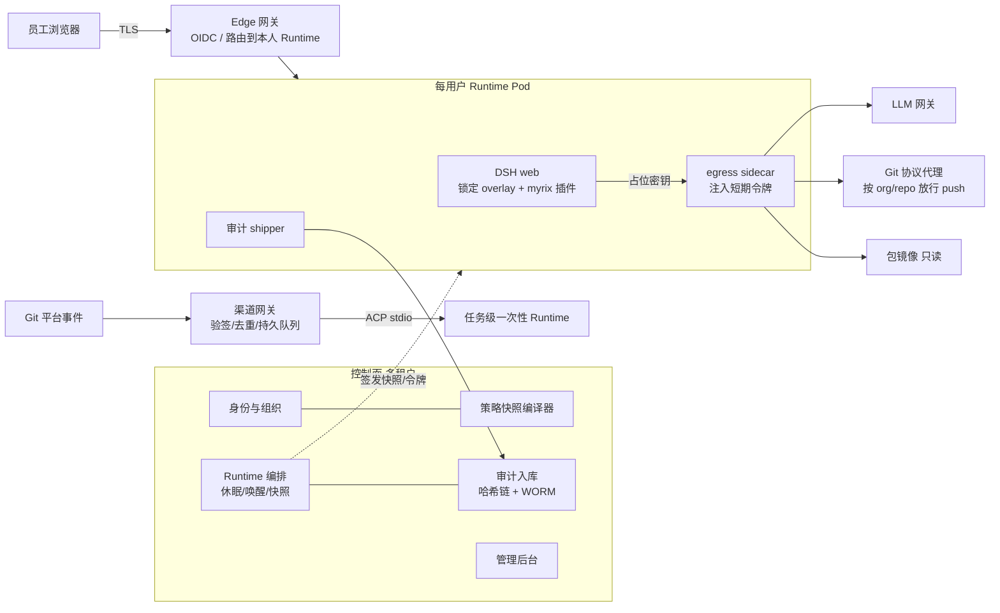

# Myrix 平台方案（三方质询定稿 v1）

> 本方案由 architect（架构/DSH 集成）、red-team（安全/合规）、product-strategist（产品/开源策略）三方各写初稿、交叉质询两轮后，由 lead 仲裁定稿。过程稿在 `.team/`。
> DSH 证据路径相对 `vendor/deepseek-harness/`，锁定提交 `639ed015`（0.2.0-rc.2 之后）。竞品与合规条款**未联网核实**，需复核。

## 0. 结论

1. **定位收窄**：对外叫"企业 Agent 运行平台"，v0.1 只做一个场景：**研发组织的受治理编码/运维 Agent**。通用低代码编排、知识问答、流程自动化不做（Dify/Coze/MaxKB/n8n 已占位，DSH 在这些方向无优势）。
2. **核心难点是多用户运行时，不是 RBAC/ABAC**。DSH 写死为单 operator、未审计的开发者预览。Myrix = 多租户控制面 + SSO 边缘网关 + 运行时编排 + 网关；DSH = **每用户一份、配置锁死的运行时**。
3. **安全边界在 DSH 进程外**：一人一容器、网络层出站默认拒绝、凭据由 sidecar 注入（不进 DSH 容器）。DSH 内的插件拦截只是第二道防线。
4. **现有仓库的安全模型和插件在真实 DSH 上不成立**，需要重写（见 §2.2）。现有 PDP 保留，降级为"签名策略快照编译器"。
5. **许可证保持 Apache-2.0 + DCO**，SSO/RBAC/审计全部开源；商业化（如需）走 LTS 发行版 + 支持订阅。
6. **节奏**：Phase 0 证伪 3 周 → 内部 Alpha 第 3 月末 → 公开 v0.1 第 6 月末；6 FTE（含 1 名全职安全），约 36 人月。

## 1. 定位与用户

| 角色 | 是谁 | v0.1 给什么 |
| --- | --- | --- |
| 买单人 | CTO / 研发效能负责人；安全负责人一票否决 | 私有化、模型自选、默认零外发、审计导出 |
| 使用者 | 工程师 | 浏览器打开即用的个人 Agent 工作区（复用 DSH Web UI）+ PR 自动 review |
| 管理员 | 平台工程 / DevOps | compose 一小时装好、组→角色→profile 映射、强制终止实例 |
| 审计员 | 安全团队 | 谁、何时、以谁的身份、让 Agent 做了什么 |

北极星指标：每周由 Agent 产出或显著参与、并被合并的 PR 数。

差异化（只写能被证据支撑的）：插件粒度的能力裁剪（`docs/architecture.md:11-13`）、国产/私有模型优先、默认零外发的加固发行版。**不宣称"统一治理 Codex/Claude Code/ACP 子代理"**：它们在独立进程里执行，DSH 管线看不到其内部工具调用（`packages/subagent/subagent-codex/src/wire.ts:32-43`、`packages/subagent/subagent-acp/src/index.ts:3`）。

## 2. DSH 的真实边界

### 2.1 决定架构的事实

| 事实 | 证据 | 推论 |
| --- | --- | --- |
| 单 operator，`admit()` 不判断"是谁"，所有 controller 不看 peer | `packages/client/connection/src/operator-peer.ts:1-33`、`rpc-host.ts:104-113` | 共进程多用户 = 重写 api 层 = fork，**否决** |
| 未审计、非生产可用，会有破坏性变更 | `SAFETY.md:7,15`、`README.md:13` | 不能当唯一安全控制 |
| 沙箱只限文件写：bwrap 无 `--unshare-net`、Seatbelt `allow default` | `packages/sandbox/sandbox-local/src/profiles.ts:17,52` | 出站必须在网络层管 |
| 同 UID 可读凭据文件；env 清洗只按名称 | `packages/credentials/credentials-local/README.md:200`、`packages/subprocess/subprocess/src/index.ts:47` | 长期密钥不进容器 |
| Web 终端以 OS 用户运行，不受沙箱/审批约束 | `packages/api/terminal-controller/README.md:30` | 默认关 |
| home patch 可写 + HMR 默认热重载 | `docs/architecture.md:27`、`packages/boot/app-boot/README.md:63` | 注入可自我卸载治理插件，配置必须只读 + 禁 HMR |
| 模型可写插件进宿主、插件管理器可装任意包 | `packages/extensions/cordis-host-runner/README.md:62`、`packages/bundle/base/cordis.patch.yml:16-22` | 企业 profile 删行 |
| 默认外发：session-log-deepseek、插件清单、OTel 遥测 | `packages/bundle/base/cordis.patch.yml:43-44,77-78,204-211` | 删行 + 出站兜底 |
| 会话日志无删除/留存 API | `packages/session/session-persistence/README.md:152` | "平台不存正文"不成立 |
| webhook 进程内、无队列/重试/去重 | `packages/webhook/webhook/README.md:71-73` | 不能做平台入口 |
| ACP `authenticate` 无鉴权；`session/new` 可注入 stdio MCP | `packages/acp/acp/README.md:65-66` | 只走容器内 stdio，网关剥离 `mcpServers` |
| `ctx.tools.register` 存在 | `packages/core/tools/src/index.ts:1063-1088` | 原文档"注册 API 未确认"风险关闭 |

### 2.2 现有 Myrix 代码的硬伤（Phase 0 第一批用例）

| 位置 | 问题 | 后果 |
| --- | --- | --- |
| `plugins/dsh-plugin-governance/src/plugin.ts:42-62` | 返回 `{type}` 而非 `{kind}`，读不存在的字段，不调 `next()` | **allow 路径 fail-open**：跳过全部 guard 直接派发并短路后续监听；ask 被硬拒（`core/tools/src/index.ts:1505-1535`） |
| 同文件 `:64-73` | async guard，真实签名是同步 `(exec)=>string\|undefined` | Promise 恒非 undefined |
| 同文件 `:55-57` | 字符串当 `Session` 传给 `permissionPresets.set`；preset 切换可放宽 | 违反"只收窄" |
| `plugins/dsh-plugin-entitlement/src/plugin.ts:43-67` | 在插件 ctx 上 `restrict`（必须 agent ctx）；轮询只会累积收紧 | 抛错 / 泄漏 disposer |
| `plugins/dsh-plugin-governance/src/policy-client.ts:29,54` | `failClosed:false` 可放行；缓存键不含 context/tenant | 违反仓库硬性规则 1 |
| `packages/control-plane/src/server.ts:105-159,226-231` | 管理面与数据面共用令牌；信任请求体 `principalId` | **越权以任意用户查知识库** |
| `packages/dsh-shim` | 结构类型与真实 API 全面偏离 | typecheck 假阳性 |
| `deploy/docker-compose.yml:12-18` | Postgres 弱口令且映射宿主 5432 | 生产不可用 |

## 3. 总体架构

分层：

| 层 | 负责 | 不负责 |
| --- | --- | --- |
| 控制面 | 身份归一、策略编译与签名、Runtime 生命周期、审计入库、后台 | 工具执行、模型调用 |
| 网关层（权威执行点） | Edge 认证、LLM 白名单/配额、Git/包协议级出站、渠道入口 | 保存策略 |
| 数据面 Runtime | DSH + 锁定 overlay + 同步 guard（第二道）+ shipper | 认证、跨用户隔离 |
| 企业既有系统 | IdP 的 MFA、知识库最终 ACL（v0.2 起） | 平台账号 |

## 4. 关键决策（含仲裁）

| # | 决策 | 否决的备选 | 仲裁说明 |
| --- | --- | --- | --- |
| D1 | 一人一 Runtime（容器 + RWO 块存储卷，挂 `$DSH_HOME` 与工作区）；自动化用任务级一次性容器 | 共进程多用户；一会话一容器；NFS | 三方一致。JSONL 依赖 flock + hard link（`session-persistence-jsonl/README.md:164-165`），不用 NFS |
| D2 | 出站默认拒绝；Git 和包管理走**协议感知代理**（push 只到企业仓库，镜像只读禁 publish） | 按域名白名单 | 采纳 architect：放行 github.com 等于允许 push 到攻击者仓库 |
| D3 | 凭据 **sidecar 注入**：DSH 只配占位密钥，同 Pod sidecar 替换鉴权头；令牌 ≤15 分钟、受众限网关、绑定来源 Pod、带 actor 链（sub=执行主体，act=触发者）；审计外送前脱敏 | 令牌进容器靠条件兜底；改 PeerScope；请求头透传 principal | 三方方案取最严且最便宜的组合。依据：pi-ai 只需 key 头（`llm-pi-ai/README.md:227`），DeepSeek 适配器只发 `x-api-key`（`llm-deepseek-api-key/src/index.ts:41`） |
| D4 | 锁定 overlay（最后一层 `--patch`）：配置只读挂载、禁 HMR、启动自检（禁用行存在 / HMR 开 / 配置可写 → 拒绝启动） | 信任用户 home 配置 | 采纳 red-team：否则注入可写 home patch 热卸载治理 |
| D5 | PEP：控制面把策略编译成**签名快照**，同步 guard 本地求值；快照缺失/过期/验签失败全拒。pre-execute 只做 ask 与打点，必须调 `next()`。restrict 只管模型可见性 | 每次调用在线问 PDP；deny 放 pre-execute | guard 必须同步（`core/tools/src/index.ts:731,769`） |
| D6 | PDP 保留自研、砍 ABAC，降级为快照编译器（约 1–2 人周）；出现运行时 ABAC 需求再评估 Cedar | 立即换 OPA/Cedar | 三方 R2 一致改主意：现有代码约 400 行，换引擎收益接近零，安全边界也不在 PDP |
| D7 | 功能裁剪走冷路径：按人渲染 preset + overlay，新会话生效；在途会话靠 guard 立即拒绝 | 热路径 restrict 掩码 | restrict 管不到 preset 内的 scoped 工具（`index.ts:1090-1094`） |
| D8 | 审计：session 日志全文外送为主审计源，正文落客户对象存储（对象锁），Myrix 建元数据索引；**哈希链在平台入库时做**；外送滞后超阈值（默认 5 分钟 / 1GB，可配）用 `agent/pre-step` 拒新 turn，高敏租户可设 0 | 只存元数据；源头哈希链；审计失败立即停机 | ADR-0004"不存正文"改写为"存且管留存/删除"。卷生命周期 = 正文留存期 |
| D9 | 审批：v0.1 的 DSH 原生 ask 只叫"本人确认"；高风险动作（push 受保护分支、对外发送、`sandbox_permissions` 提权）**直接 deny**；v0.2 接飞书/钉钉他人审批，由 Myrix answerer 记录审批人 | 把原生 ask 当审批 | 采纳 red-team：`approval/decided` 不记审批人（`user-approval/src/index.ts:225-232`） |
| D10 | Web 终端默认关；PoC-4 证明配置由另一 UID 持有且只读后按角色开 | 默认开 | 三方一致 |
| D11 | 外部子代理（Codex/Claude Code/ACP）、stdio MCP、hooks、auto-review、computer/browser-use v0.1 全部删行 | 保留并"统一治理" | 三方一致 |
| D12 | 渠道：v0.1 只有 Web + 一个 PR review 自动化（内部 ACP 驱动任务容器，服务主体运行、只给评论权限）；IM 与公开 API 放 v0.2 | 首发 IM/API；复用 DSH webhook | 采纳 product/red-team（architect 主张 PR 自动化可砍，列为第二砍刀） |
| D13 | 上游：Runtime 用 npm 精确版本 `@deepseek-ai/dsh`；紧急补丁用 pnpm `patchedDependencies`；submodule 改为指向官方仓库、对齐同一 tag 的只读参照；锁 integrity、内网镜像、自建镜像 cosign 签名 + SBOM；升级 = 卷快照 → 迁移 → 观察 → 可回滚 | submodule 源码构建；维护个人 fork | 会话格式只前向迁移（vendor `AGENTS.md`），所以快照是升级前置条件 |
| D14 | UI 复用 DSH Web UI，Phase 0 验证能否仅靠配置去品牌化 | 自建对话 UI | 自建 UI 会绑死未稳定的内部线协议；品牌规范要求避免暗示官方背书（`BRAND_GUIDELINES.md:9-10`） |
| D15 | 合规：交付"可达等保三级的加固基线文档 + 检查清单"；v0.1 拆 admin/auditor 两角色、MFA 继承 IdP（校验 `amr/acr`）；完整三权分立 v0.2 | 等保三级作为所有部署的默认 | 定级是部署方的事 |

## 5. 永不砍的安全基线

1. SSO 边缘网关（TLS），Runtime 端口只接受 Edge 流量。
2. 一人一容器；跨用户隔离渗透用例进 CI。
3. 网络层出站默认拒绝 + Git/包协议代理。
4. sidecar 凭据注入，容器内无长期或他人凭据。
5. 锁定 overlay + 禁 HMR + 启动自检；删除 §4 D11 及 cordis-host-runner、plugin-manager、遥测相关行，preset 只保留允许档。
6. 控制面数据面/管理面令牌分离，接口从令牌取主体，忽略请求体身份。
7. 同步 guard + 签名快照；删除 `failClosed:false`。
8. 审计外送 + 有界滞后后拒新 turn。
9. 生产模式拒绝弱默认值（`dev-admin-token`、默认库口令、明文 0.0.0.0）。
10. SECURITY.md + 私密漏洞通道、签名镜像、SBOM；公开前一次外部渗透。

## 6. v0.1 范围

做：
- Edge（OIDC，先适配 1 个 IdP）+ 控制面（Postgres）+ Runtime 编排（Docker 单机，≤50 人）
- 企业加固 bundle 与锁定 overlay；私有/企业模型经 LLM 网关接入（`llm-pi-ai` OpenAI 兼容路由）
- 组 → 角色 → profile 授权；签名快照 + 同步 guard
- 审计全文外送、元数据检索、按主体删除（销毁卷 + 对象存储前缀删除）
- PR review 自动化：持久队列、重试、去重
- 管理后台 2–3 页：用户与角色映射、运行中实例（强杀）、审计查询
- 安装：docker-compose；兼容矩阵文档

不做（至少到 v0.3）：低代码编排、IM 发布、RAG/知识库联邦、自研 ABAC、共进程多用户、多租户 SaaS、桌面端、计费、插件市场、改 DSH 源码。

## 7. 路线图与验收

| 阶段 | 时间 | 内容 | 验收（可测） |
| --- | --- | --- | --- |
| Phase 0 证伪 | 第 1–3 周 | PoC-1/2/3/4/7/8/11 + 去品牌化验证；重写插件为单个 `dsh-plugin-myrix`，依赖真实 `@deepseek-ai/dsh-*`，删除 `dsh-shim` | 现有插件 fail-open 用例复现后被修复；未登录 100% 拒绝；抓包确认零外发；锁定 overlay 下 PoC-4 清单逐项关闭；Go/No-Go 结论 |
| 内部 Alpha | 第 3 月末 | v0.1 功能完整，1–2 个内部团队试用 | 安装 ≤1 小时；跨用户隔离用例 100% 通过；fail-open 事件 = 0；≥20 名工程师周活 |
| 公开 v0.1 | 第 6 月末 | PR 自动化稳定、文档站、SECURITY.md、外部渗透 | 自动化非模型原因失败率 ≤5%，投递不丢不重；DSH 新 tag 发布后 ≤2 周完成适配；外部渗透无 P0 |
| v0.2 | 第 9 月 | K8s + gVisor/Kata、MCP 网关 + OBO + Runtime 级出站污点（三件捆绑）、ACP 公开 API、飞书/钉钉他人审批、三权分立、知识型 preset（需设计伙伴需求） | 两个部门同问题得到不同 KB 结果且可审计；拿到 L3+ 数据后 Runtime 出站降为仅网关 |
| v0.3 / LTS 候选 | 第 12 月 | 高可用、策略即代码、IM 渠道、Host/执行世界拆分（PoC-5 通过后）、首个 LTS | ≥5 家生产部署；LTS 安全补丁 SLA 可兑现 |

每个阶段的入场条件是上一阶段的使用数据，不是能力清单。

## 8. 团队与工期

6 FTE，约 36 人月到公开 v0.1：技术负责人 1（兼上游跟踪）、后端/平台 2、云原生/DevOps 1、**安全工程 1（全职）**、前端 0.5 + 产品/开发者关系 0.5。

落后时的砍刀顺序：K8s 后端 → PR 自动化 → 后台缩到 2 页 → IdP 只留 1 个 → Helm。§5 永不砍。
少于 4 人：只做 Phase 0 + 内部自用，不对外宣称企业平台。

## 9. 开源、社区与商业化

- **许可**：Apache-2.0 + DCO，不用 AGPL（国内企业法务常一票否决），不用 fair-code，不收 CLA。保留上游 MIT 声明与 NOTICE。
- **商标**：用"基于 DSH / built on DeepSeek Harness"的描述，不用上游 logo 和配色；尽快做 Myrix 商标检索。
- **社区**：维护者主导，公开路线图与 ADR；贡献入口放在插件生态（加固 profile、模型网关适配、SIEM 导出器、Git 平台适配）。
- **商业化顺序**（如需要）：支持订阅/私有化交付 → LTS 发行版（12 个月安全补丁、吸收上游破坏性变更）→ 单租户托管 → 大型组织增值包（SCIM、跨集群 HA、合规报表、信创适配）。红线：开源版不回退、安全修复同时发布、开源版无遥测。

## 10. 主要风险

| 风险 | 级别 | 缓解 |
| --- | --- | --- |
| 上游预稳定、不收外部 PR、可能推出官方企业版 | 高 | 耦合面压到 profile/bundle/进程外；seam 一致性测试；pnpm patch 数 >3 触发架构复审 |
| 研发场景"致命三要素"齐全（私有数据 + 不可信输入 + 外发能力） | 高 | §5 基线；外部渗透进验收 |
| bwrap/landlock 在 gVisor/Kata 内不可用 | 高 | PoC-2；直通 runner 只在 D4 三条满足时启用 |
| 每用户 Runtime 的内存与冷启动成本 | 中 | 休眠/唤醒、预热池；PoC-7 定量 |
| 定位漂移成劣化版 Dify | 中 | Won't 清单写进 README |
| 竞品 OpenHands 已有容器运行时 | 中 | 差异化压在治理、私有模型、加固发行版 |

## 11. 对现有仓库的改动清单（待确认后执行）

- 重写 `plugins/*` 为单个 `dsh-plugin-myrix`，删除 `packages/dsh-shim`。
- 修复控制面：令牌分离、从令牌取主体、删 `failClosed:false`、修缓存键。
- `docs/architecture.md`：删形态 B/C（共进程）、改 §3.1 "即使 pre-execute 被绕过 deny 依旧生效"。
- ADR-0001 改为"进程外边界 + 进程内第二道"；ADR-0002 删 B1；ADR-0003 补"身份透传不防合法读后外泄"；ADR-0004 改为"存正文且管留存/删除"；新增 ADR：运行时隔离、凭据注入、审计、上游消费。
- `docs/roadmap.md`：按 §7 重写，删 M3 共进程。
- `AGENTS.md`：运行时依赖改为 npm 精确版本、submodule 只读并对齐 tag、补丁走 pnpm patch、overlay 启动自检、放宽安全默认值需 ADR。
- `.gitmodules`：url 指向官方上游（或注明是镜像）。
- 新增 `SECURITY.md`。

## 12. PoC 清单（Phase 0）

| # | 要证伪的假设 | 失败后果 |
| --- | --- | --- |
| 1 | 真实 npm 包上 guard/pre-execute/restrict 能对 web profile（含 preset 工具）生效 | 裁剪只靠冷路径 |
| 2 | DSH 沙箱在 rootless Docker / gVisor / Kata 内可探测 | 容器为唯一边界 + 直通 runner |
| 3 | Edge 反代 + OIDC + launch token 兑换 + WebSocket + 前缀挂载可用 | 改子域名路由 / sidecar 本地兑换 |
| 4 | 锁定 overlay 关闭全部逃逸面（清单见 `.team/red-team-r2.md` §5） | Host/执行拆分提前 |
| 6 | 同一 `$DSH_HOME` 上 web 与 ACP 进程可并存 | ACP 用独立 home |
| 7 | 单 Runtime 空闲内存与唤醒时延可接受 | 调整休眠/预热/规格 |
| 8 | 私有模型经 pi-ai 接入；sidecar 注入可用；关闭遥测后零外发 | 自写 LLM 适配插件 |
| 10 | 上游版本升级可迁移且可快照回滚 | 冻结版本 |
| 11 | 目标存储类满足 flock + hard link | 换块存储 |
| — | DSH Web UI 能否仅靠配置去品牌化 | 评估薄壳 UI 成本 |

## 13. 需要你拍板的问题

1. 是否接受收窄为"企业 Agent 运行平台，首个场景研发"？若真实需求是办公问答或业务流程，建议改为"Dify/Coze 开源版 + 治理补丁"，而不是从 DSH 起步。
2. 你们是企业内部自用，还是做对外开源产品/公司？有没有 1–2 个可当设计伙伴的研发团队？
3. 能否给到 6 FTE × 6 个月（含 1 名全职安全）？
4. 基础设施：有无 K8s？能否用 gVisor/Kata？存储类是否只有 NFS？
5. 模型：私有部署还是可用 DeepSeek 官方 API？已有 LLM 网关吗？
6. 会话全文落企业自有对象存储，合规上能否接受？目标客户是否要求等保三级/密评/信创（含 LoongArch）？
7. IdP 与首个 Git 平台分别是什么（Keycloak/飞书/企微；GitHub/GitLab）？
8. 上游 fork `hewenyu/deepseek-harness` 是否可以改为只读镜像，运行时改从 npm 消费？
